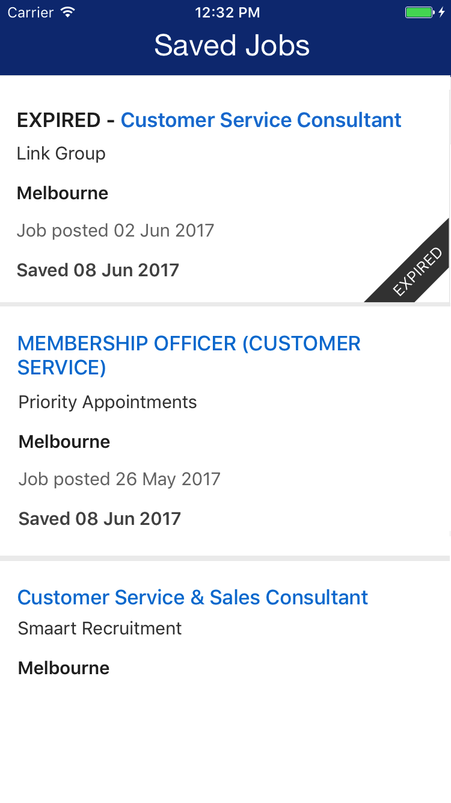

# Our very own iOS Homework Task

Hello! Welcome to our homework task.

This task should only take you a couple of hours all together so please don't spend too much time on it. If you have any questions, feel free to ask or make any assumptions you like as long as you document and have a good reason for them.

Good luck and we look forward to seeing your solution!


## The Task

Clone this template project. It is written in Swift 4 so please continue using Swift and Xcode 8. Also use storyboards as much as is convenient and try to avoid using any other third party libraries. Assume that you will only have to support iPhones for now.

#### Step 1

This project contains a fake api call. Use it to display the content in the table as shown below.



#### Brownie points
Too easy? Or just having the time of your life and want to keep going? Try one of the below for some brownie points:

* filter by a search term

## Expectations

We are looking for production ready code. This means we will be looking for all the usual programming best practises:

* thoughtful architecture
* tests
* documentation
* code style and readability

This also means we will looking to end up with a working app and dare I say, even a delightful one!

## Setup

This project uses [CocoaPods](https://cocoapods.org/about). If you don't have CocoaPods installed please do so by following the guide [here](https://guides.cocoapods.org/using/getting-started.html). 

Once you have CocoaPods installed run the following:

```swift
pod install
```

Then open up the .xcworkspace (as opposed to the .xcodeproj) in Xcode and you're good to go!
